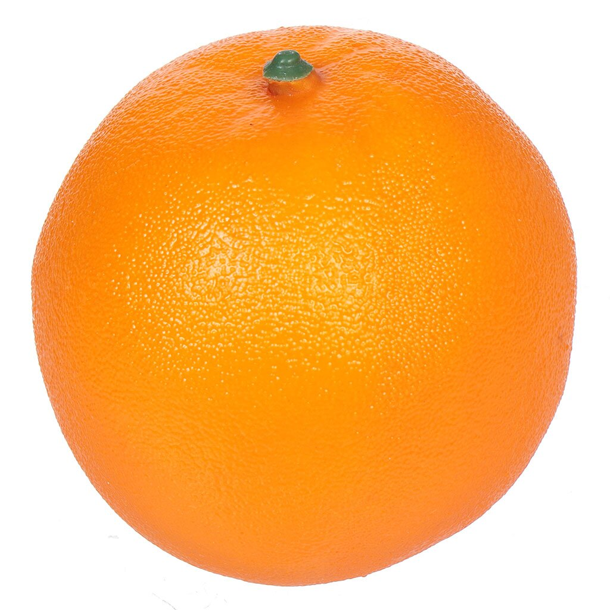
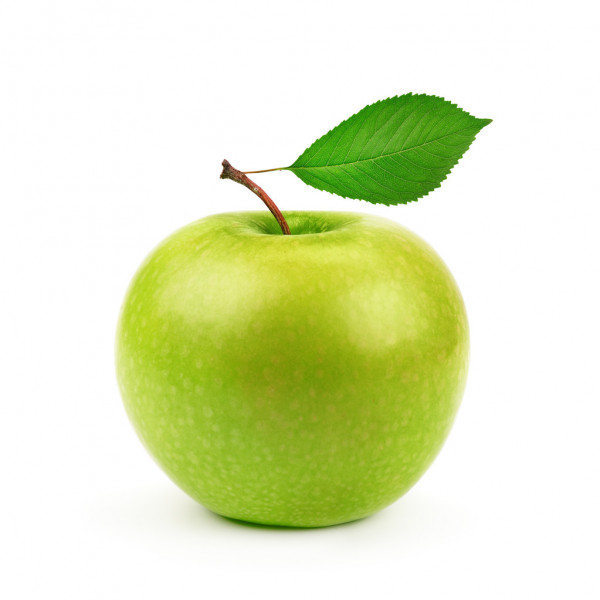

# Руководство по Markdown/ Markdown manual

## Выделение/How is it in english

**Жирный шрифт** выделяется двойной звёздочкой (**) или двойным подчёркиванием (__) с двух сторон.

## Списки/lists

Нумерованный список: просто ставим номер и точку
1. номер 1
2. номер 2

Ненумерованный:
Звёздочка или плюс

## Вставка изображения

## Цитаты

Цитаты добавляются при помощи символа (>)